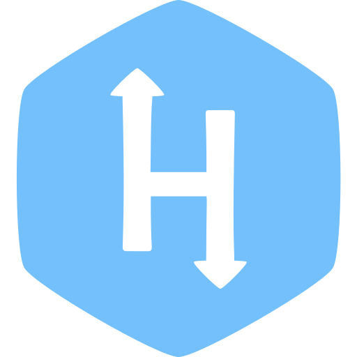

  <a href="https://github.com/YasserFat7alah">
    <h1 align="center" > Yasser Fathallah</h1>
  </a>

 

### 🤓 Who am I? (Briefly):

<!-- - 🔭 Fullstack developer at Intlaq -->

- 🌱 I’m currently learning **Backend Development & Software Development**

- 👯 I’m looking to collaborate with other developers

- 💬 Ask me about **JavaScript and NodeJS**

- 📫 How to reach me **YasserFat7alah@gmail.com**

- 📄 Take a look at [ My Portfolio]()

 

    
### 👨‍💻Connect with me

    &nbsp;&nbsp;
    
    &nbsp;&nbsp; 
    
    &nbsp;&nbsp;
    
    &nbsp;&nbsp; 
    
    &nbsp;&nbsp;
    
    &nbsp;&nbsp;
    

    Interested in my work?
    <a href="https://www.buymeacoffee.com/YasserFat7alah" target="_blank" style= 'font-weight: bold; font-size:14px'>Buy Me A Coffe.
</a>

<!--

-->
 

### 🏆 Github trophies

  

 

<h3 align="left"> Languages and Tools:</h3>
<h4 align="left"> Skills and Languages </h4>

  &nbsp;&nbsp;&nbsp;&nbsp;
   
  &nbsp;&nbsp;
   
  &nbsp;&nbsp;
  
  &nbsp;&nbsp;
  
  &nbsp;&nbsp;
  
  &nbsp;&nbsp;
  
   
  &nbsp;&nbsp;&nbsp;&nbsp;
  
  &nbsp;&nbsp;
  
  &nbsp;&nbsp;
  
  &nbsp;&nbsp;
  
  &nbsp;&nbsp;
   
  &nbsp;&nbsp;
  
 

 
<h4 align="left"> Utility tools  </h4>

  &nbsp;&nbsp;&nbsp;&nbsp;
  
  &nbsp;&nbsp;
  
  &nbsp;&nbsp;
  
  &nbsp;&nbsp;
  

 

### 👦 Github Stats:

 

 

